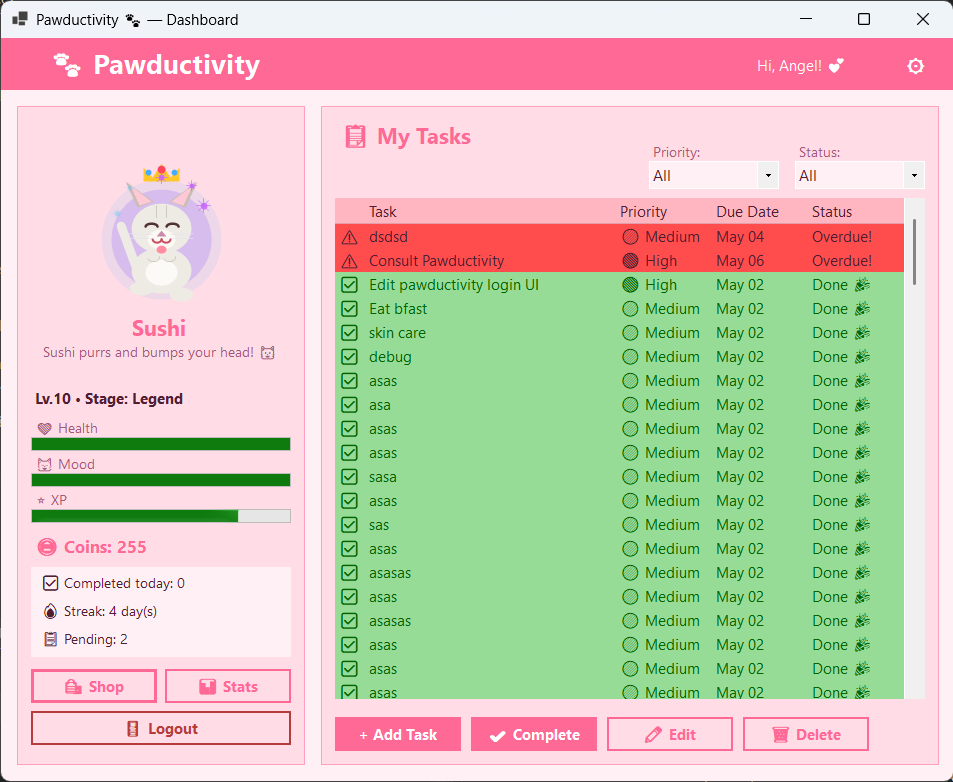
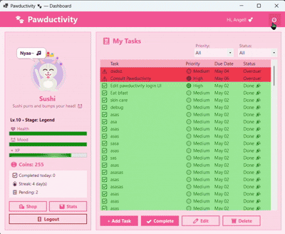
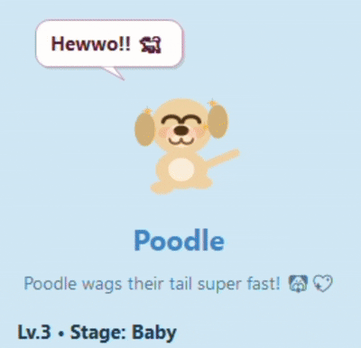
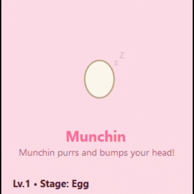
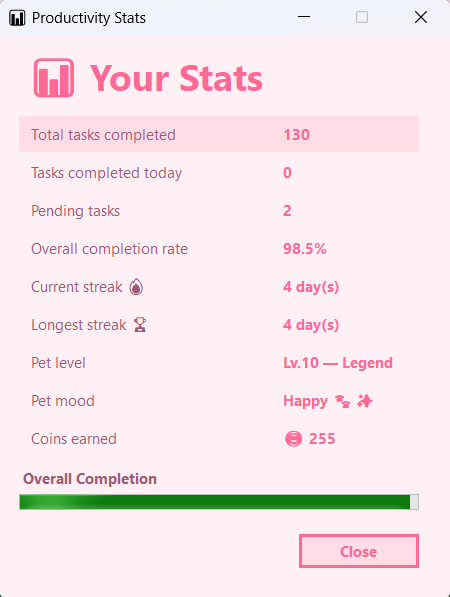
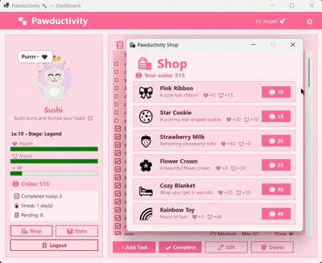
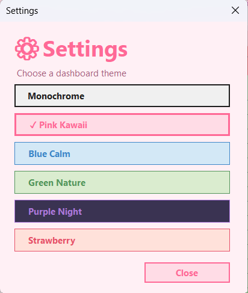
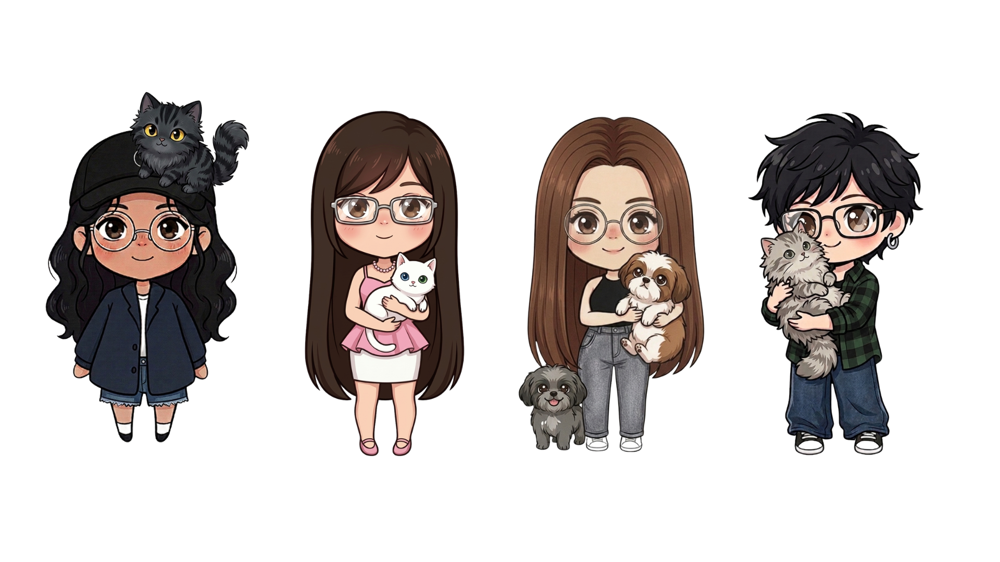

<div align="center">

# 🐾 Pawductivity

**A Digital Pet Productivity System**

*CS 222 · Advanced Object-Oriented Programming · Batangas State University*


> *Stay productive. Keep your pet happy. Don't let your tasks go overdue.*

</div>

---

## 📖 Overview

**Pawductivity** is a gamified productivity desktop app built with **.NET 8 WinForms**. You adopt a virtual pet — a cat 🐱 or a dog 🐶 — and your tasks directly affect its health, mood, level, coins, and evolution.

Complete tasks and your pet gains XP, mood, health, and coins. Let tasks become overdue and your pet loses health and mood. The app features animated pet reactions, floating stat-change animations, coin gain effects, shop item animations, and switchable dashboard themes — so your pet feels alive while you stay on top of your work.

It's a productivity tool with stakes — and a little companion watching your every move.

---

## 🚀 Getting Started

### Prerequisites

| # | Requirement | Details |
|---|---|---|
| 1 | [Visual Studio Community](https://visualstudio.microsoft.com/vs/community/) | Windows only — WinForms requires Windows |
| 2 | **.NET Desktop Development** workload | Select this during Visual Studio installation |
| 3 | **.NET 8 SDK** | Required by `net8.0-windows` |

### Running the App

1. Open **Visual Studio Community**
2. Click **Open a project or solution**
3. Navigate to the `Pawductivity/` folder
4. Open `Pawductivity.slnx`
5. Press **F5** to build and run

> 💡 **Tip:** Use `Ctrl + F5` to run without the debugger for a faster startup.

---

## 📁 Project Structure

```text
Pawductivity/
├── Pawductivity.slnx              ← Solution file
├── Pawductivity.csproj            ← Project file (net8.0-windows, nullable enabled)
├── Program.cs                     ← Entry point (starts with StartupForm)
├── PawTheme.cs                    ← Theme system: 6 palettes, fonts, button/card styles
│
├── Assets/
│   └── startup_bg.png             ← Background image for StartupForm
│
├── Animations/
│   ├── PetAnimationState.cs       ← Pet animation state enum (Idle, Happy, Sad, Sick)
│   └── PetRenderer.cs             ← GDI+ drawing for cat/dog (5 evolution stages each),
│                                    speech bubbles, hearts, sparkles, tears, thermometer
│
├── Controls/
│   └── PetAnimationControl.cs     ← Custom PictureBox: timer-driven pet animation,
│                                    floating effects, shop purchase animations
│                                    (ItemFlightEffect, AccessoryOverlayEffect, BurstParticle)
│
├── Models/
│   ├── Pet.cs                     ← Abstract base class: encapsulated stats with clamping,
│   │                                level-up logic, evolution stages, RestoreStats()
│   ├── PetTypes.cs                ← CatPet (high XP, mood-sensitive) and DogPet
│   │                                (forgiving mood, more health gain)
│   ├── AppTheme.cs                ← Theme palette model (15 color slots per theme)
│   ├── PetChangeResult.cs         ← Record for stat-change deltas returned to UI
│   ├── TaskItem.cs                ← Task model with Guid IDs, priority, due dates,
│   │                                overdue tracking, and WasOverdue flag
│   ├── ShopItem.cs                ← Shop item model with emoji, cost, health/mood boosts
│   └── SaveData.cs                ← Serializable snapshots (SaveData, PetSaveData, TaskSaveData)
│
├── Managers/
│   ├── GameManager.cs             ← Core game logic: CRUD tasks, complete/overdue penalties,
│   │                                shop purchases, streak tracking, analytics helpers
│   └── SaveManager.cs             ← JSON persistence: atomic temp-then-rename writes,
│                                    profile list/load/delete, snapshot/restore
│
└── Forms/
    ├── StartupForm.cs             ← Splash/welcome screen (app entry point)
    ├── LoginForm.cs               ← Profile selector and new profile creation
    ├── DashboardForm.cs           ← Main screen: task ListView, pet panel, stat bars,
    │                                nav buttons, theme rebuild, decay timer
    ├── TaskEditForm.cs            ← Dialog for adding/editing tasks with due date picker
    ├── SettingsForm.cs            ← Theme selection grid with live preview cards
    ├── ShopForm.cs                ← Shop item grid with purchase confirmation flow
    └── StatsForm.cs               ← Productivity analytics: completed/missed totals,
                                     streaks, completion rate, pet level summary
```

---

## 🖼️ Visual Preview

<div align="center">

### Start Up


### Dashboard



### Theme Switching



### Pet Animation




</div>

---

## 🔄 Gameplay Loop

```text
Login → Add Task → Complete Task → Pet Reacts → Earn Coins → Buy Items
           ↑                                                       |
           └───────────────────── loop ────────────────────────────┘
```

Every task you complete rewards you and your pet. Every overdue task applies a health and mood penalty **once per calendar day**, then remembers it — so the same task won't drain your pet repeatedly every minute.

Progress is **automatically saved** when the app closes and restored on reopen. Profiles, pet stats, tasks, streaks, coins, selected theme, and overdue penalty state are all persisted to `%APPDATA%/Pawductivity/` as atomic JSON writes.

---

## 🎮 Features

| Feature | Status |
|---|:---:|
| Startup/splash screen | ✅ |
| Login with username and pet name | ✅ |
| Multi-profile support | ✅ |
| Choose Cat 🐱 or Dog 🐶 | ✅ |
| Add, edit, delete, and complete tasks | ✅ |
| Task priority (Low/Medium/High) and due-date tracking | ✅ |
| Complete tasks → pet gains XP, mood, health, and coins | ✅ |
| Overdue tasks → pet loses health and mood once per day | ✅ |
| Pet levels up and evolves through 5 stages | ✅ |
| Hand-drawn GDI+ cat and dog animations (5 stages each) | ✅ |
| Speech bubbles with mood-based messages | ✅ |
| Task completion floating animations (XP, mood, coins) | ✅ |
| Overdue penalty floating animations (health, mood loss) | ✅ |
| Shop item purchase animations (flight, burst particles, accessory overlay) | ✅ |
| Coin-based shop system (6 items) | ✅ |
| Daily streak tracking (current + longest) | ✅ |
| Productivity stats and analytics screen | ✅ |
| Settings form with 5 switchable themes | ✅ |
| Theme persistence per profile | ✅ |
| Data persistence via JSON with atomic writes | ✅ |
| Theme live rebuild without app restart | ✅ |
| Custom owner-drawn ListView with theme-aware colors | ✅ |
| Logout flow with profile switching | ✅ |

---

## 🌱 Pet Evolution

<div align="center">
  
  
</div>

Your pet evolves through five stages as you level up. Each level costs `current_level × 50 XP`, so progression gets harder over time.

| Stage | Level | Cat 🐱 | Dog 🐶 |
|---|---|---|---|
| 🥚 **Egg** | 1 | `🥚` | `🥚` |
| 🐱 **Baby** | 2–3 | `🐱` | `🐶` |
| 🐈 **Junior** | 4–6 | `🐈‍⬛` | `🐕` |
| 🐈 **Adult** | 7–9 | `🐈` | `🦮` |
| ✨ **Legend** | 10+ | `✨🐈‍⬛✨` | `✨🐕‍🦺✨` |

**How XP works:** Cats earn more XP per task but lose mood faster when one is missed. Dogs earn slightly less XP but are more forgiving on mood — though they take more health damage.

| Pet | High priority | Medium priority | Low priority |
|---|---:|---:|---:|
| 🐱 Cat XP | +30 | +20 | +10 |
| 🐶 Dog XP | +25 | +15 | +8 |

> Each pet starts with **Health 80 · Mood 70 · Level 1 · 0 coins**. Health and mood are clamped between 0–100, and coins can never go below 0. At 0 health, XP gain is locked.

---

## 😺 Mood System

Your pet's mood is a 0–100 value that maps to one of four states:

| Mood | State | Emoji | Effect |
|---|---|---|---|
| 70–100 | Happy | `🐾✨` | Positive greetings and happy animation |
| 40–69 | Neutral | `🐾` | Calm, waiting behavior |
| 20–39 | Sad | `😿` / `🥺` | Sad expression and animation |
| 0–19 | Sad | `😿` / `🥺` | Same as Sad — Sick is triggered by Health ≤ 19 |

### Task Effects

| Event | Cat 🐱 | Dog 🐶 |
|---|---|---|
| Complete high task | +30 XP, +15 Mood, +5 Health, +15 Coins | +25 XP, +20 Mood, +8 Health, +12 Coins |
| Complete medium task | +20 XP, +15 Mood, +5 Health, +10 Coins | +15 XP, +20 Mood, +8 Health, +7 Coins |
| Complete low task | +10 XP, +15 Mood, +5 Health, +5 Coins | +8 XP, +20 Mood, +8 Health, +4 Coins |
| Miss overdue task | −20 Mood, −8 Health | −12 Mood, −10 Health |

Overdue penalties are applied once per calendar day per overdue task via `TaskItem.OverduePenaltyApplied` and `GameManager.LastPenaltyDate`.

---

## 🐾 Pet Animations

The animation system is fully decoupled from the dashboard UI. `DashboardForm` hosts `PetAnimationControl`, while all drawing logic lives in `Animations/PetRenderer.cs`.

| Event | Animation |
|---|---|
| Idle | Gentle bounce, blinking, mood-based expression |
| Bounce | Excited bouncing animation on shop purchase |
| Speech bubble | Random cat/dog messages based on mood |
| Task completed | XP, mood, and coin floating text |
| Task overdue | Health and mood loss floating text |
| Coin reward | Coin gain animation after task completion |
| Shop purchase | Item flight, burst particles, accessory overlay, happy jump, coin deduction text |

### Animation Effects (`PetAnimationControl.cs`)

| Effect | Description |
|---|---|
| `FloatingEffect` | Fading upward text for stat changes |
| `ShopItemEffect` | Item-specific emoji animation (eating, sip, sparkle, bloom, cozy, play) |
| `ItemFlightEffect` | Shop item flies up from bottom of screen |
| `AccessoryOverlayEffect` | Wearable items (ribbon, crown) hover above pet |
| `BurstParticle` | Radial burst of particles for non-food items |
| `Happy jump` | Double-bounce jump animation on purchase |

---

## 📊 Stats & Analytics

<div align="center">



</div>

The **Stats screen** (`StatsForm`) gives you a snapshot of your productivity over time. Access it from the dashboard to review your progress and see how well you've been keeping your pet happy.

Tracked metrics include:

| Metric | Description |
|---|---|
| Tasks completed | Total number of tasks finished |
| Current streak | Consecutive days with at least one task completed |
| Longest streak | Your all-time best streak |
| Coins earned | Total coins accumulated from task completions |
| Pet level | Current evolution stage and level progress |
| Completion rate | Percentage of all tasks that are completed |
| Tasks completed today | Count of tasks finished today |
| Pending tasks | Count of tasks still incomplete |

Use the stats screen to spot patterns — if your pet keeps getting sick, it's a sign your task completion rate needs work. 🐾

---

## 🛍️ Shop

<div align="center">



</div>

Coins are earned by completing tasks (`XP gained ÷ 2`). Spend them to restore your pet's health and mood.

| Item | Cost | Health | Mood | Animation |
|---|:---:|:---:|:---:|---|
| 🎀 Pink Ribbon | 10 | — | +15 | Ribbon sparkle |
| 🍪 Star Cookie | 15 | +20 | +10 | Eating animation |
| 🍓 Strawberry Milk | 20 | +30 | — | Sip animation |
| 🌸 Flower Crown | 25 | — | +30 | Bloom effect |
| 🛏️ Cozy Blanket | 30 | +25 | +20 | Cozy effect |
| 🌈 Rainbow Toy | 40 | — | +40 | Play animation |

Items are categorized internally as **Food** (Star Cookie, Strawberry Milk) or **Wearable** (Pink Ribbon, Flower Crown), which affects which animation effects trigger.

---

## ⚙️ Themes

<div align="center">



</div>

Open settings via the `⚙` button in the top bar to switch themes instantly. Each profile saves its own theme selection. The dashboard can rebuild itself with the new theme without restarting the app. Themes are presented as styled color-swatch buttons showing the theme's surface and primary colors.

| Theme | Style |
|---|---|
| Pink Kawaii | Original soft pink theme |
| Blue Calm | Light blue productivity palette |
| Green Nature | Fresh green palette |
| Purple Night | Dark purple theme |
| Strawberry | Warm red-pink palette |
| Monochrome | Minimal grayscale theme |

Theme palettes live in `PawTheme.cs`. `PawTheme.SetTheme(...)` updates the active palette, and forms read colors from static properties:

```csharp
public static Color Background => _activeTheme.Background;
public static Color Primary    => _activeTheme.Primary;
public static Color Surface    => _activeTheme.Surface;
// ...
```

---

## 🎓 OOP Principles

Pawductivity demonstrates all four core OOP concepts deliberately and practically.

### 🔒 Encapsulation — `Models/Pet.cs`

Core stats are protected with private backing fields. Public properties enforce rules on every write:

```csharp
public int Health
{
    get => _health;
    set => _health = Math.Clamp(value, 0, 100);  // always within bounds
}

public int XP
{
    get => _xp;
    set { _xp = value; CheckLevelUp(); }          // auto level-up check
}

public int Coins
{
    get => _coins;
    set => _coins = Math.Max(0, value);            // never negative
}
```

### 🧬 Inheritance — `Models/Pet.cs` → `CatPet` / `DogPet`

`Pet` is an abstract base class that owns shared data, mood calculation, level-up logic, evolution stages, and save/restore logic. `CatPet` and `DogPet` inherit everything and add their own behavior.

```csharp
public abstract class Pet { ... }
public class CatPet : Pet { ... }
public class DogPet : Pet { ... }
```

### 🔀 Polymorphism — `Models/PetTypes.cs`

Abstract methods ensure each subclass reacts in its own way. `GameManager` calls the same method regardless of pet type:

```csharp
public abstract void ReactToTaskCompleted(TaskItem task);
public abstract void ReactToTaskMissed();
public abstract string GetGreeting();
```

### 🏗️ Abstraction — `Managers/GameManager.cs`, `Managers/SaveManager.cs`, `Controls/PetAnimationControl.cs`

Forms call simple, expressive methods without knowing the internal rules:

```csharp
var change   = _gm.CompleteTask(task.Id);
var overdue  = _gm.ApplyOverduePenalties();
var purchase = _gm.BuyItem(item);
```

Each method returns a `PetChangeResult` that tells the UI exactly what changed — keeping game logic out of the forms entirely. Save/load is similarly hidden behind `SaveManager.Save(_gm)` and `SaveManager.Restore(data)`.

---

## 🔮 Future Improvements

| Improvement | Description | Where to Edit |
|---|---|---|
| **Add more pet species** | Add hamsters, rabbits, or birds as new pet options with unique evolution stages, animations, and stat behaviors | `Models/PetTypes.cs` (new subclass), `Animations/PetRenderer.cs` (new draw methods), `Managers/SaveManager.cs` (new pet type string) |
| **More shop items** | Add new purchasable items with custom animation effects and stat boosts | `Models/ShopItem.cs` (add to DefaultShop), `Controls/PetAnimationControl.cs` (new effect cases, categorization) |
| **Customizable pet names & appearance** | Allow users to pick pet colors, accessories, or patterns | `Models/Pet.cs` (add appearance fields), `Animations/PetRenderer.cs` (accept color parameters), `Forms/LoginForm.cs` (selection UI) |
| **Sound effects** | Add audio feedback for task completion, shop purchases, level-ups, and pet reactions | New `AudioManager.cs`, integrate into `DashboardForm.cs` event handlers and `Controls/PetAnimationControl.cs` |
| **Achievements system** | Track milestones (e.g., first task, 100 coins, 7-day streak) with unlock notifications | New `Models/Achievement.cs`, `Managers/AchievementManager.cs`, display in `Forms/DashboardForm.cs` or new `AchievementsForm.cs` |
| **Task categories/tags** | Organize tasks into categories like Work, Personal, School with color-coded filters | `Models/TaskItem.cs` (add Category property), `Forms/DashboardForm.cs` (filter UI), `Forms/TaskEditForm.cs` (category picker) |
| **Recurring tasks** | Support daily, weekly, or monthly repeating tasks | `Models/TaskItem.cs` (add Recurrence enum + interval), `Managers/GameManager.cs` (auto-regenerate completed recurring tasks) |
| **Task subtasks** | Break large tasks into smaller checkable subtasks | `Models/TaskItem.cs` (add List<Subtask>), `Forms/TaskEditForm.cs` (subtask editor), `Forms/DashboardForm.cs` (expandable rows) |
| **Notifications/reminders** | Windows toast notifications or in-app alerts for upcoming due tasks | New `Managers/NotificationManager.cs`, timer in `Forms/DashboardForm.cs`, or Windows API integration |
| **Export/import data** | Allow users to backup and restore profiles as JSON files | `Managers/SaveManager.cs` (export/import methods), add buttons to `Forms/LoginForm.cs` |
| **Cloud sync** | Sync profiles across devices via a cloud backend or GitHub Gist | New `Managers/CloudSyncManager.cs`, HTTP client calls, auth flow in `Forms/LoginForm.cs` |
| **Productivity charts** | Visual graphs showing task completion trends over days/weeks | New `Controls/ChartControl.cs` using GDI+ or a charting library, integrate into `Forms/StatsForm.cs` |
| **Pomodoro timer** | Built-in 25-minute focus timer that rewards the pet on completion | New `Controls/PomodoroTimer.cs`, integration into `Forms/DashboardForm.cs`, reward logic in `Managers/GameManager.cs` |
| **More themes** | Add seasonal or user-customizable color themes | `PawTheme.cs` (new AppTheme entries), `Models/AppTheme.cs` (if palette structure changes) |
| **Drag-and-drop task reordering** | Visually reorder tasks by priority through drag and drop | `Forms/DashboardForm.cs` (ListView drag events), `Managers/GameManager.cs` (reorder list) |
| **Pet mini-games** | Quick games to boost mood when the pet is sad | New `Forms/MiniGameForm.cs` base class, specific game implementations, triggered from `DashboardForm.cs` or pet panel |
| **Weather integration** | Display local weather and give mood hints based on conditions | New `Managers/WeatherManager.cs` with API calls, display in `Forms/DashboardForm.cs` pet panel |
| **Pet breeding/companions** | Allow multiple pets or pet companions that interact | `Managers/GameManager.cs` (List<Pet> instead of single Pet), `Controls/PetAnimationControl.cs` (multi-pet rendering), `Models/SaveData.cs` |
| **Keyboard shortcuts** | Hotkeys for common actions (Ctrl+N new task, Ctrl+E edit, Ctrl+K complete) | `Forms/DashboardForm.cs` (KeyPreview + KeyDown handler), `Forms/TaskEditForm.cs` |
| **Accessibility improvements** | Screen reader support, higher contrast modes, scalable fonts | `PawTheme.cs` (accessibility palette), all `Forms/*.cs` (AccessibleName/Role properties), `PawTheme.StyleButton` |

---

<div align="center">

## 📐 UML Diagrams

### Class Diagram


### Sequence Diagram — Task Completion Flow


</div>

> The PlantUML source files are in [`docs/pawductivity_uml.puml`](docs/pawductivity_uml.puml) and [`docs/pawductivity_sequence.puml`](docs/pawductivity_sequence.puml).

---

<div align="center">

## 👥 Team


**Team LAVA** · CS-2202 · Batangas State University
| Member | Role |
|---|---|
| [AENCRUZ](https://github.com/AENCRUZ) | Lead Developer & Full-Stack Engineer |
| [ancimochi](https://github.com/ancimochi) | UI/UX Designer & Game Logic Developer |
| [Riossium](https://github.com/Riossium) | Animations, Frontend & QA |
| [aleckxareign](https://github.com/aleckxareign) | Game Features & Systems Developer |

*Made with 💖 for CS 222 — Advanced Object-Oriented Programming*

</div>
